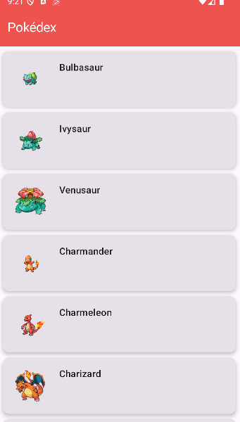
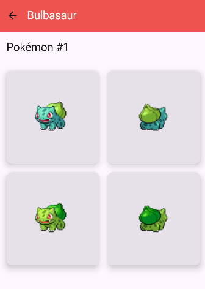

# 📱 PokeAPI App

Android application built with **Kotlin + Jetpack Compose** that consumes the [PokeAPI](https://pokeapi.co/) to display a list of Pokémon and their details.

---

## ✨ Features

- Pokémon list with images and names.  
- Detail screen showing:  
  - 4 sprites (front/back, normal/shiny).  
  - Basic information.  
- **Dynamic TopBar**:  
  - "Pokédex" on the list screen.  
  - Pokémon name + back button on the detail screen.  
- Simple **MVVM** architecture using `ViewModel`, `StateFlow`, and `Repository`.
- Includes a loading animation while the data is loading.
- Includes an error message in case something went wrong with the http call.

---

## 🛠️ Tech Stack

- [Kotlin]
- [Jetpack Compose]  
- [Navigation Compose]  
- [Coroutines + Flow]
- [Retrofit] → API requests  
- [Coil] → image loading  

---

## 🏗️ Project Structure

- `app/`
  - `src/`
    - `main/`
      - `java/`
        - `com/`
          - `uvg/`
            - `pokeapi/`
              - `data/`
                - `api/` - RetrofitClient and ApiService
                - `models/` - Pokemon
                - `repository/` - PokemonRepository
              - `ui/`
                - `view/` - MainActivity (contains ListScreen + DetailScreen)
                - `viewModel/` - PokemonViewModel
                - `theme/` - Compose theming (colors, typography, etc.)


---

## 🚀 Getting Started

1. Clone the repository:
   ```bash
   git clone https://github.com/your-username/pokeapi-app.git
2. Open the project in Android Studio.

3. Sync Gradle dependencies.

4. Run the app on an emulator or Android device (minSdk 24+ recommended).

## 📸 Screenshots


### Pokémon List


### Pokémon Detail



